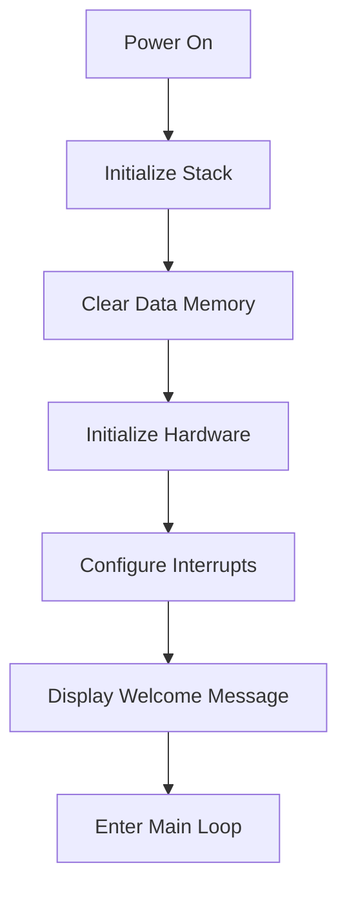
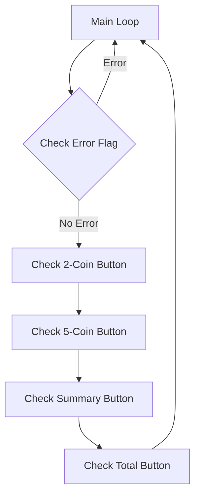
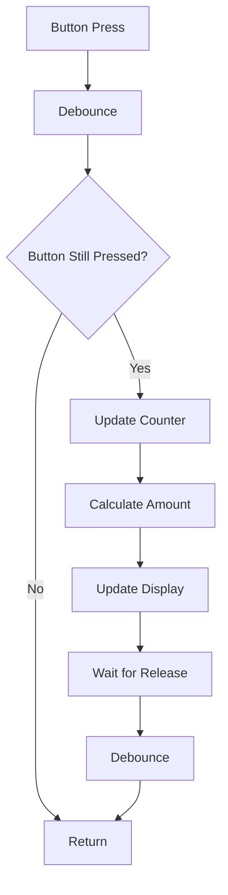
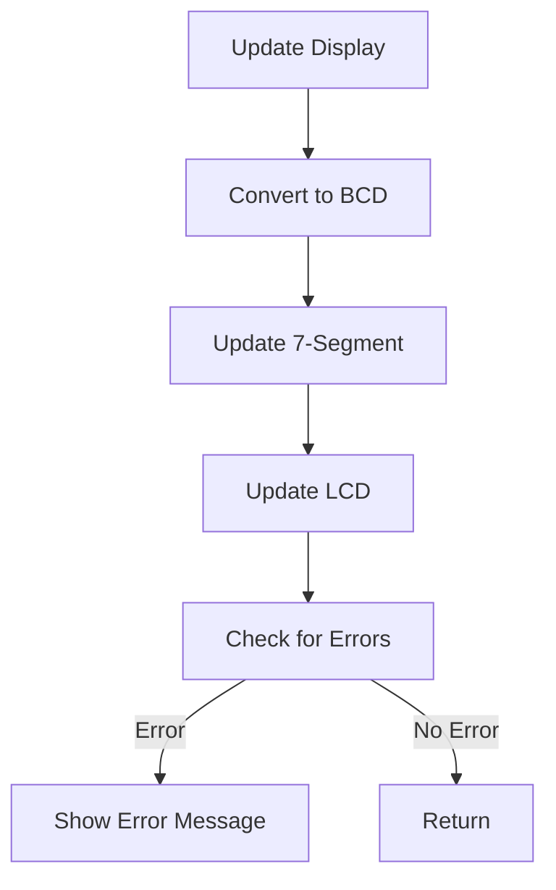
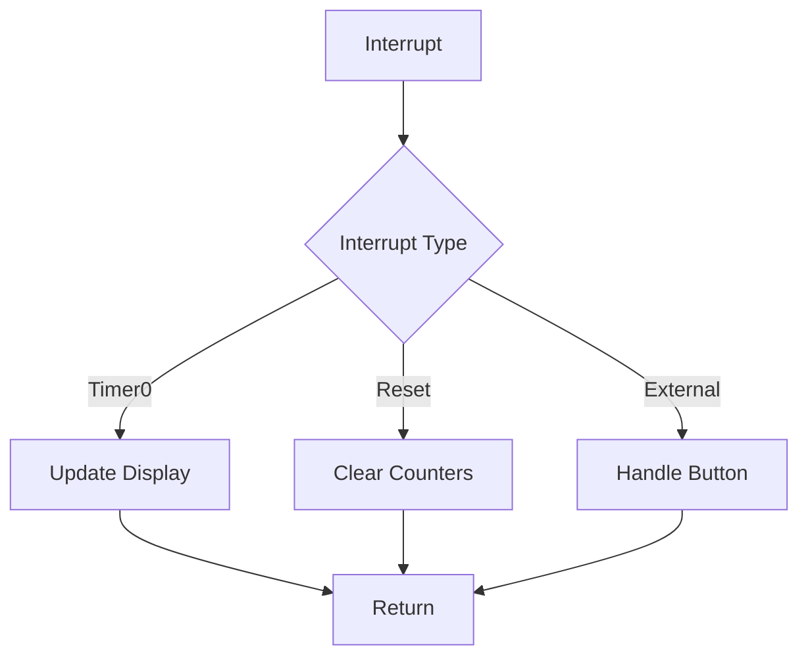

# Coin Counter Project Documentation

## Overview
This project implements a coin counter system using an 8051/8052 microcontroller. The system is designed to count and track different denominations of coins (2 and 5 units) with a maximum capacity of 9999 units.

## 🧰 Kit Contents

| Component | Specification / Module | Quantity | Purpose |
|-----------|----------------------|----------|----------|
| IR Sensor | TCRT5000 | 2 | Coin detection |
| Microcontroller | AT89S52 (8051) IC | 1 | Main processing unit |
| Development Board | 8051 Compatible | 1 | Base platform |
| LCD Display | 16x2 Characters | 1 | Status display |
| NOT Gate IC | IC 7404 | 2 | Signal inversion |
| Resistor | 10kΩ | 3 | Pull-up/Pull-down |
| Push Button | Standard | 3 | User input |
| Potentiometer | 10kΩ | 1 | LCD contrast control |
| Breadboard | Small Size | 1 | Circuit prototyping |
| Connecting Wires | Male-to-Male / Male-to-Female | As Required | Circuit connections |

### Additional Requirements
- Power Supply: 5V DC
- Programming Cable: ISP (In-System Programming)
- Soldering Equipment (if needed)
- Basic Tools (screwdriver, wire stripper, etc.)

### Component Details

#### IR Sensor (TCRT5000)
- Operating Voltage: 3.3V to 5V
- Detection Range: 2-10mm
- Output Type: Digital (High/Low)
- Package: Through-hole

#### Microcontroller (AT89S52)
- Architecture: 8051
- Flash Memory: 8KB
- RAM: 256 bytes
- Operating Voltage: 4.0V to 5.5V
- Clock Speed: Up to 33MHz

#### LCD Display (16x2)
- Display Type: Alphanumeric
- Interface: 8-bit parallel
- Backlight: LED
- Operating Voltage: 5V

#### Development Board
- Crystal: 11.0592MHz
- Reset Circuit
- ISP Header
- Power LED
- Reset Button

## Features
- Dual coin denomination support (2 and 5 units)
- 16-bit amount tracking (up to 9999)
- 4-digit 7-segment display output
- LCD status display
- Reset functionality
- Button debouncing
- Error handling for maximum capacity

## Hardware Requirements
### Microcontroller
- 8051/8052 compatible microcontroller

### Display
- 4-digit 7-segment display
- LCD display (16x2)

### Input Devices
- 2-coin button (P3.0)
- 5-coin button (P3.1)
- Summary button (P0.0)
- Total button (P0.1)
- Reset button (P3.2)
- Start button (P0.2)
- IR sensors (P0.5, P0.6)

### Port Configuration
```
+------------------+------------------+------------------+------------------+
|      Port 0      |      Port 1      |      Port 2      |      Port 3      |
+------------------+------------------+------------------+------------------+
| Bit 7: --        | Bit 7: --        | Bit 7: DB7       | Bit 7: --        |
| Bit 6: IR2       | Bit 6: --        | Bit 6: DB6       | Bit 6: --        |
| Bit 5: IR1       | Bit 5: --        | Bit 5: DB5       | Bit 5: --        |
| Bit 4: --        | Bit 4: --        | Bit 4: DB4       | Bit 4: --        |
| Bit 3: --        | Bit 3: --        | Bit 3: DB3       | Bit 3: --        |
| Bit 2: BTN_START | Bit 2: EN        | Bit 2: DB2       | Bit 2: RESET_BTN |
| Bit 1: BTN_TOTAL | Bit 1: RW        | Bit 1: DB1       | Bit 1: BTN_5COIN |
| Bit 0: BTN_SUMMARY| Bit 0: RS       | Bit 0: DB0       | Bit 0: BTN_2COIN |
+------------------+------------------+------------------+------------------+

Legend:
- DB0-DB7: LCD Data Bus Lines
- RS: LCD Register Select
- RW: LCD Read/Write
- EN: LCD Enable
- BTN_2COIN: 2-Coin Button Input
- BTN_5COIN: 5-Coin Button Input
- BTN_SUMMARY: Summary Display Button
- BTN_TOTAL: Total Amount Button
- BTN_START: Start Button
- RESET_BTN: System Reset Button
- IR1, IR2: Infrared Sensors
- --: Unused/Reserved
```

## Software Architecture

### Memory Organization
- Stack Pointer: 70H
- Counter Variables:
  - 2-coin amount (30H-31H)
  - 5-coin amount (32H-33H)
  - 2-coin count (34H-35H)
  - 5-coin count (36H-37H)
  - Total amount (38H-39H)
- Display digits (40H-44H)

### Key Functions
1. **Initialization**
   - Stack initialization
   - Hardware setup
   - LCD initialization
   - Interrupt configuration

2. **Main Operations**
   - Coin counting (2 and 5 units)
   - Amount calculation
   - Display updates
   - Error handling

3. **Display Functions**
   - LCD message display
   - 7-segment display multiplexing
   - Status updates

4. **Input Handling**
   - Button debouncing
   - Interrupt service routines
   - Reset functionality

## Structure Flow

### Program Initialization Flow


### Main Program Flow


### Coin Counting Flow


### Display Update Flow


### Interrupt Handling Flow


### Memory Organization
```
+------------------+
|    Program       |
|    Memory        |
+------------------+
|   0000H: Main    |
|   0003H: Reset   |
|   ...            |
+------------------+
|    Data Memory   |
+------------------+
|   30H-31H: 2-Coin|
|   32H-33H: 5-Coin|
|   34H-35H: Count2|
|   36H-37H: Count5|
|   38H-39H: Total |
|   40H-44H: Digits|
+------------------+
|    Stack (70H)   |
+------------------+
```

## Usage Instructions

1. **Power On**
   - System initializes and displays welcome message
   - All counters reset to zero

2. **Coin Counting**
   - Press 2-coin button to count 2-unit coins
   - Press 5-coin button to count 5-unit coins
   - System automatically updates total amount

3. **Display Functions**
   - Summary button shows current counts
   - Total button displays total amount
   - Reset button clears all counters

4. **Error Handling**
   - System displays error message when maximum capacity (9999) is reached
   - Press reset button to clear error and restart

## Technical Details

### Interrupt Configuration
- Timer0: Used for display multiplexing
- External Interrupt 0: Reset functionality
- Interrupt priority configuration enabled

### Display Messages
- Welcome message
- Count displays
- Amount displays
- Error messages
- Status updates

## Limitations
- Maximum count: 9999 units
- Requires manual reset when maximum capacity is reached
- Limited to two coin denominations

## Future Enhancements
1. Support for additional coin denominations
2. Data logging capability
3. Serial communication interface
4. Power management features
5. Extended display capabilities

## Troubleshooting
1. If display shows incorrect values:
   - Press reset button
   - Check power supply
   - Verify button connections

2. If system becomes unresponsive:
   - Press reset button
   - Check for error messages on LCD
   - Verify all connections

## Maintenance
- Regular cleaning of coin sensors
- Periodic display testing
- Button functionality verification
- Power supply monitoring
